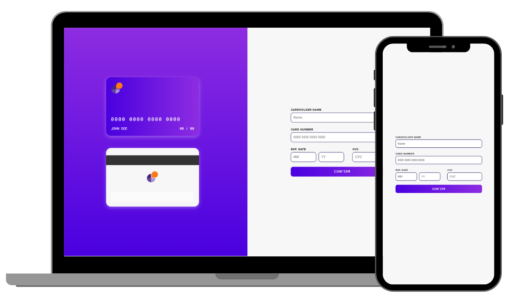
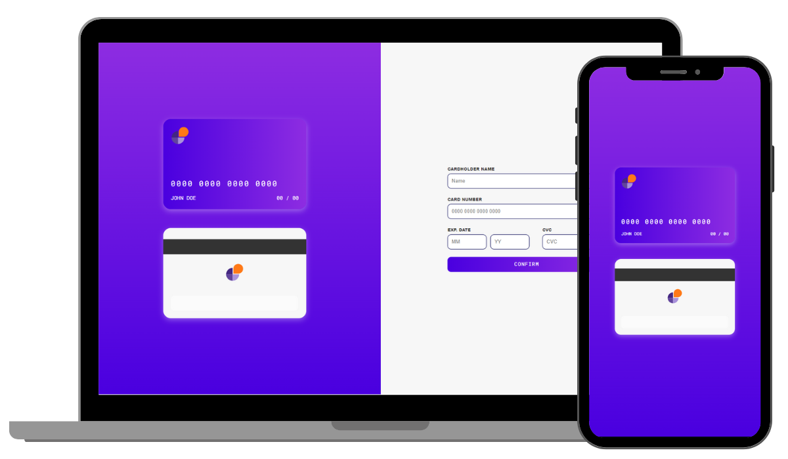

# » Take My Card, Please 
### Educational project. [ `NEXT.JS` | `JAVASCRIPT` | `CSS / SASS`]

 
I created this site using NEXT.JS, Javascript and CSS/SASS during my fifth month of study. 
By filling the inputs, you'll see the card change. 
Both for Mobile and Desktop. 
 

> [!NOTE] 
> My skills have improved since the day I made this site. 
> There are mistakes I could have corrected, but I chose not to on purpose. 
> In this way I intend to keep a history of my progress. 
 
[ Aug 04, 2024 ]
